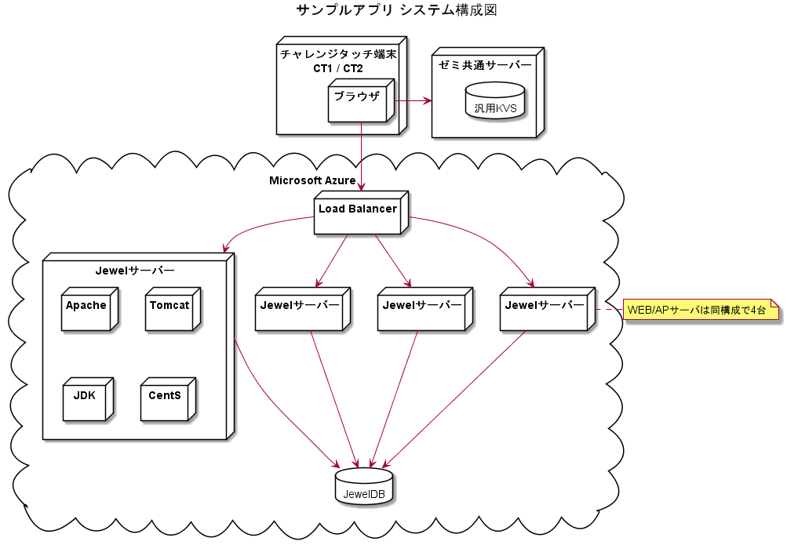
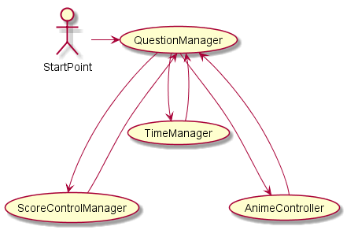
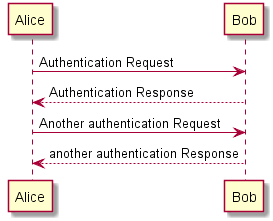

<div style="text-align:right">
  <strong style="color:red;">CONFIDENTIAL ベネッセコーポレーション</strong>
  <hr style="background-color:#3f50b5;">
</div>

<p><b><font size="7">サンプルアプリ　アプリ設計</font></b></p>

<!-- TOC -->

- [1. システム構成](#1-システム構成)
    - [1.1. ミドルウェア一覧](#11-ミドルウェア一覧)
- [2. コンポーネント設計](#2-コンポーネント設計)
- [3. データ設計](#3-データ設計)
    - [3.1. 設定データ](#31-設定データ)
        - [3.1.1. サンプル設定01](#311-サンプル設定01)
            - [3.1.1.1. ファイル仕様](#3111-ファイル仕様)
            - [3.1.1.2. 項目](#3112-項目)
            - [3.1.1.3. ファイルサンプル](#3113-ファイルサンプル)
    - [3.2. KVS](#32-kvs)
        - [3.2.1. セーブデータ](#321-セーブデータ)
            - [3.2.1.1. 保存先](#3211-保存先)
            - [3.2.1.2. 項目](#3212-項目)
- [4. イベント設計](#4-イベント設計)
    - [4.1. イベント競合マトリクス](#41-イベント競合マトリクス)
        - [4.1.1. サンプルシーンでのイベント競合マトリクス](#411-サンプルシーンでのイベント競合マトリクス)
- [5. 例外処理（エラーハンドリング）方式](#5-例外処理エラーハンドリング方式)
    - [5.1. 基本方針](#51-基本方針)
    - [5.2. エラー一覧](#52-エラー一覧)
- [6. 処理設計](#6-処理設計)
    - [6.1. 共通処理](#61-共通処理)
        - [6.1.1. SBox認証](#611-sbox認証)
        - [6.1.2. やりすぎ防止](#612-やりすぎ防止)
    - [6.2. アプリ固有処理](#62-アプリ固有処理)
        - [6.2.1. サンプル処理](#621-サンプル処理)

<!-- /TOC -->

# 1. システム構成

```ひな形メモ
システム全体をモジュール分割し、各々の責務を記述する。
従来の構成から変わらなけらば、割愛してOK。以下、例文。
---
小１提供のアプリのため、チャレンジタッチ端末（CT2）を利用する。
※タッチ端末付属アプリのため、システム構成は割愛
---
```



| 名称                 | 説明                                                                                                                                                                                               |
| :------------------- | :------------------------------------------------------------------------------------------------------------------------------------------------------------------------------------------------- | :--------------------- |
| チャレンジタッチ端末 | フロントエンドアプリはチャレンジタッチのブラウザ上で動作する。<br>ゼミ共通サーバーとHTTPs通信を行い、セーブデータを保存/取得する。<br>JewelサーバーとHTTPs通信を行い、ゲームコンテンツを取得する。 | 有（ゲームコンテンツ） |
| ゼミ共通サーバー     | 汎用KVSを利用して、セーブデータを保存/取得を行う。                                                                                                                                                 |
| Load Balancer        | 複数台稼働するJewelサーバーへのロードバランシングを行う。                                                                                                                                          |
| Jewelサーバー        | 育てゲームコンテンツを配置/取得を行う。最大4台のJewelサーバーが同時稼働する。                                                                                                                      |

## 1.1. ミドルウェア一覧

| 配置          | 用途           | ミドルウェア           | バージョン |
| :------------ | :------------- | :--------------------- | :--------- |
| Jewelサーバー | OS             | CentOS                 | 7          |
|               | WEBサーバ      | Apache HTTP Server     | 2.4.33     |
|               | APサーバー     | Apache tomcat          | 8.5.28     |
|               | Javaランタイム | Oracle Java JVM(64bit) | 8          |

# 2. コンポーネント設計

```ひな形メモ
主要なコンポーネントを抽出し、各々の責務を記述する。
```



| 名称 | 責務 |
| :--- | :--- |
|      |      |

# 3. データ設計

```ひな形メモ
アプリケーションの外部にI/Oがあるデータは必ず記述する。
内部のデータについては任意とする。
```

## 3.1. 設定データ

```ひな形メモ
外部ファイルとして管理する設定データについて記述する。
```

本アプリで使用する設定データについて記述する。

| 名称           | フォーマット | 説明                 |      |
| :------------- | :----------- | :------------------- | :--- |
| サンプル設定   | JSON         | ＊＊に関する設定の定義 |      |
| ゲームイベント | Enum         | ゲームイベントの定義 |      |

### 3.1.1. サンプル設定01

設定データはJSONファイルとして管理、ビルド時にapkに組み込まれる。

#### 3.1.1.1. ファイル仕様

| 項目                 | 値                                              |
| :------------------- | :---------------------------------------------- |
| ファイルフォーマット | JSON                                            |
| 文字コード           | UTF-8                                           |
| 改行コード           | LF                                              |
| ファイル名           | sample_setting.json                             |
| ディレクトリ         | (プロジェクトのルートフォルダ)/Assets/Json/App/ |

#### 3.1.1.2. 項目

| 論理名                   | key1        | key2          | key3         | 型                   | 説明                                            |
| :----------------------- | :---------- | :------------ | :----------- | :------------------- | :---------------------------------------------- |
| スコア上限値             | maxScore    |               |              | integer              |                                                 |
| キャラクター一覧         | characteres |               |              | List\<CharacterInfo> |                                                 |
| キャラクター名称         |             | characterName |              | string               |                                                 |  |  | hintStrings |  | HintStrings |  |
| ヒント文字列オブジェクト |             | hintStrings   |              | HintStrings          |                                                 |
| ヒント文字列1            |             |               | hintString01 | string               | キャラクター説明画面のヒントラベル1に表示される |
| ヒント文字列2            |             |               | hintString02 | string               | キャラクター説明画面のヒントラベル2に表示される |
| 表示フラグ               |             | isDisplay     |              | boolean              | true:表示する, false:表示しない                 |

#### 3.1.1.3. ファイルサンプル

``` sample_setting.json
{
    "maxScore":99999
    "characteres:[
        {
            "characterName":"name1",
            "hintStrings:{
                "hintString01":"hoge",
                "hintString02":"fuga",
            },
            "isDisplay:true
        },
        {
            "characterName":"name2",
            "hintStrings:{
                "hintString01":"foo",
                "hintString02":"bar",
            },
            "isDisplay:false
        }
    ]
}
```

## 3.2. KVS

```ひな形メモ
KVSに関するデータについて記述する。
```

本アプリでKVSに保存するデータは以下の通り。

### 3.2.1. セーブデータ

#### 3.2.1.1. 保存先

```ひな形メモ
KVSを利用する場合の保存先について記述する。
・ローカルKVSに保存
・小ゼミ汎用サーバーのKVSに保存
```

- ローカルKVSに保存

#### 3.2.1.2. 項目

| key1         | key2 | key3 | 値の型  | 説明                                             | 登録・更新タイミング                                     | 参照タイミング | デフォルト値 |
| :----------- | :--- | :--- | :------ | :----------------------------------------------- | :------------------------------------------------------- | :------------- | :----------- |
| app_strt_cnt | -    | -    | integer | アプリ起動回数                                   | アプリ起動シーン表示時にインクリメント                   | アプリ起動時   | 0            |
| ttl_pic_cnt  | -    | -    | integer | 個別写真の総撮影枚数（＝シャッターを切った回数） | シャッターボタン押下時にインクリメント                   | アプリ起動時   | 0            |
| fp_pic_cnt   | -    | -    | integer | 定点カメラ写真の完成回数                         | 定点カメラ編集画面でかんせいボタン押下時にインクリメント | アプリ起動時   | 0            |

# 4. イベント設計

```ひな形メモ
イベント競合マトリクスは、競合が発生するパターンに着目して記述する。
（すべてのイベントを羅列する必要はない）
```

## 4.1. イベント競合マトリクス

\- : 競合しない
 ○ : 競合するが問題なし
 イベント名 : 競合する際に優先するイベント

### 4.1.1. サンプルシーンでのイベント競合マトリクス

|       |   A   |   B   |   C   |
| :---: | :---: | :---: | :---: |
|   A   |   -   |  〇   |   C   |
|   B   |       |       |       |
|   C   |       |       |       |

# 5. 例外処理（エラーハンドリング）方式

例外処理の方式について記述する。

## 5.1. 基本方針

- 業務エラー
  - 入力エラー等の業務エラーは例外とせず、戻り値としてエラーを返す
- システムエラー
  - 例外発生個所においてリカバリ可能な例外については、捕捉・リカバリを行う
  - リカバリ不可能な例外については捕捉せず、上位に通知する
  - アプリケーション最上位に集約的例外ハンドラを実装する
    - 集約的例外ハンドラでは、ユーザーにエラーを通知した後、アプリケーションの終了処理を行う

## 5.2. エラー一覧

| エラーコード | 発生タイミング | 処理 |
| ------------ | -------------- | -------------- |
|              |                |                |

# 6. 処理設計

## 6.1. 共通処理

```ひな形メモ
各アプリの共通処理について記述する。
従来CTCommon設計に記述していた「SBox認証」「やりすぎ防止」の想定。
```

### 6.1.1. SBox認証

- CTCommonの要件に従い、起動時の認証処理を行う。

### 6.1.2. やりすぎ防止

- 低学年 / 高学年 設定で使用する

## 6.2. アプリ固有処理

```ひな形メモ
アプリ固有の処理仕様を記述する。
```

### 6.2.1. サンプル処理




<div style="text-align:right">
  <hr style="background-color:#3f50b5;">
</div>
