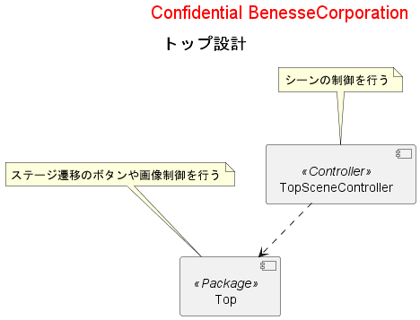
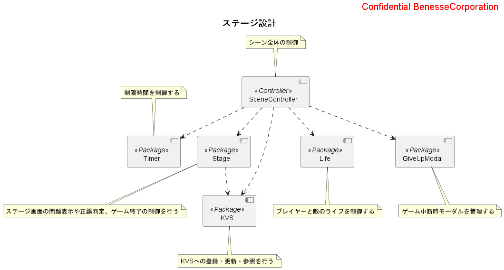
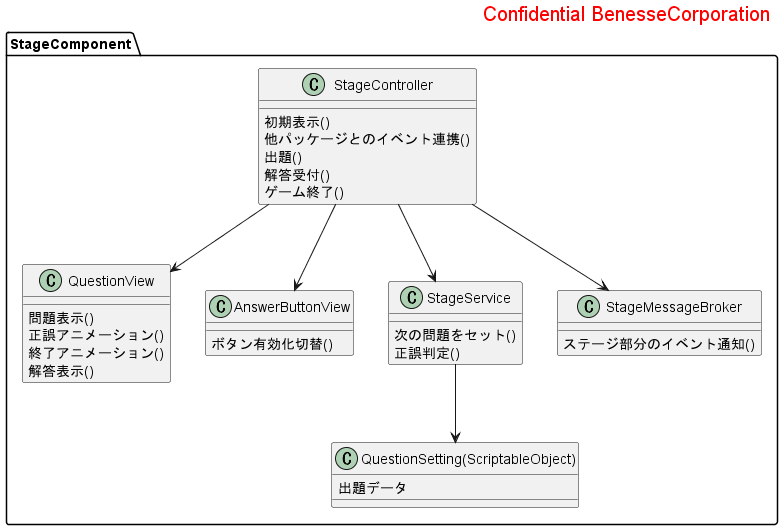
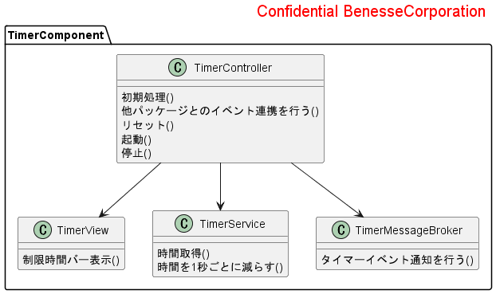
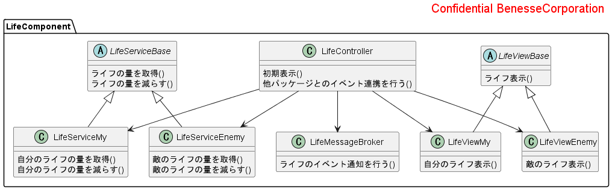
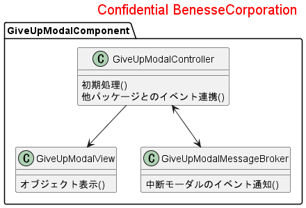
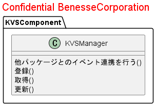
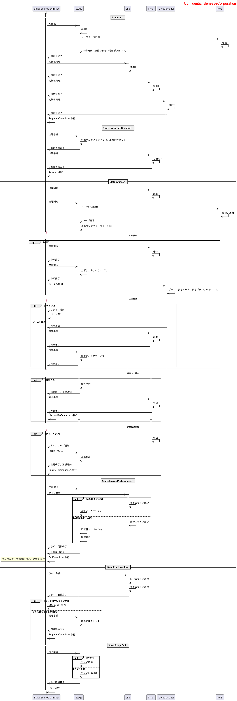

  <strong style="color:red;">CONFIDENTIAL ベネッセコーポレーション</strong>
  

<b>マジカル九九クエスト　アプリ設計</b>

# 1. システム構成

小 ２ 提供のアプリのため、チャレンジタッチ端末（CTZ）を利用する。 
※タッチ端末付属アプリのため、システム構成は割愛

イベントの送受信方法として送信者と受信者がお互いを知る必要がないUniRXのMessageBrokerを利用する。
MessageBrokerを利用することで 送信者が受信者の参照を保持する必要がなく、
受信者も送信者もMessageBroker（仲介者）への参照を持つことで、
パッケージ間の疎結合を実現することを目的とする。

 

# 2. コンポーネント設計

<!-- 下記の表より画面表示のみしかない画面は記載を省略する。 -->

| Unity シーン名           | 画面名                      | 画面表示のみ |
| :----------------------- | :------ | :-------------------------- |
| YarisugiBoushi          | やりすぎ防止                | ○           |
| Top                      | TOP                     | ○           |
| ExerciseStage          | ステージ       　　      | -           |

## 2.1. コンポーネント一覧

| 名称                  | 責務                                      |
|-----------------------|-----------------------------------------|
| Top            | TOP画面のボタン等の制御を行う |
| Stage          | ステージ画面の問題表示や正誤判定の制御を行う |
| Timer          | 制限時間を制御する |
| Life           | プレイヤーと敵のライフを制御する |
| KVS            | ステージ情報を記録する |
| GiveUpModal    | ゲーム中断時モーダルを管理する |

## 2.2 トップ

## 2.3 ステージ

## 2.4 Stageパッケージのクラス図

## 2.5 Timerパッケージのクラス図

## 2.6 Lifeパッケージのクラス図

## 2.7 GiveUpModalパッケージのクラス図

## 2.8 KVSパッケージのクラス図

## 2.6 シーケンス図

 

# 3. データ設計

## 3.1. 設定データ

本アプリで使用する設定データについて記述する。

| 名称                   | フォーマット | 説明                                            |
| :--------------------- | :----------- | :---------------------------------------------- |
| ステージ問題設定 | Excel | ステージの問題、解答などを設定                 |

### 3.1.1. ステージ設定

#### 3.1.1.1. ファイル仕様

| 項目                 | 値                                                                    |
| :------------------- | :-------------------------------------------------------------------- |
| ファイルフォーマット | Excel(.xlsx)                                                          |
| ファイル名           | StageSetting.xlsx                                           |
| ディレクトリ         | (プロジェクトのルートフォルダ)/Assets/Packages/Stage/Excel/ |

#### 3.1.1.2. 項目

設定データはScriptableObject に変換して設定データを作成する。

| 項番 | パラメーター論理名 | パラメーター物理名   | 型          | 補足                 |
| :---- | :-------- | :---------- | :--------- | :---------- |
| 1 |-| QuestionInfoList | List\<QuestionInfo> |  |

- QuestionInfo

| 項番 | パラメーター論理名 | パラメーター物理名   | 型          | 補足                 |
| :---- | :-------- | :---------- | :--------- | :---------- |
| 1 | 設問番号 | QuestionNo      | int    |  |
| 2 | かけられる数 | QuestionLeftNum | int |  |
| 3 | かける数 | QuestionRightNum | int |  |
| 4 | 解答     | Answer          | int |  |

### 3.2.1. セーブデータ

#### 3.2.1.1. 保存先

- ローカル KVS に保存

#### 3.2.1.2. 項目

| key1 | key2 | key3 | 値の型 | 説明 | 登録・更新タイミング | 参照タイミング | デフォルト値 |
| :- | :- | :- | :- | :- | :- | :- | - |
| QuestionState | null | null | int | 出題している問題の状態を管理する 保存する値には設問番号の数字が入る。| ・出題時 | ・ステージ画面遷移時 | 0            |

 

# 4. イベント設計

## 4.1. 共通方針

全画面において、イベント実行中に同一のイベントや他のイベントが走ることがないように制御する。

### 4.1.1. 画面遷移時の制御

ボタン押下時に画面にある全てのボタンを非活性とすることでイベントが2つ以上走ることのないように制御する。
画面内で動作しているアニメーション・コルーチンを破棄する。

### 4.1.2. 演出の制御

演出時は画面にある全てのボタンを非活性とする。
1画面内に複数の演出が発生するときは演出の順序を定義できれば、その順序で演出を表示する。

## 4.2. 発生イベント概要

| 画面名 | 発生イベント | 複数発生 |
|-------|--------|:--------:|
| TOP | 画面遷移 | × |
| ステージ | 画面遷移 出題 解答受付 正誤判定 正誤演出 解答表示 ライフ更新 中断 タイムアップ ゲーム終了判定 ゲーム終了演出 | ◯ |

## 4.3. 個別のイベント制御

1画面内で複数のイベントが同時発生する画面でのイベント制御を記載する。

### 4.3.1. ステージ

画面遷移後に正誤演出・解答・中断モーダル・ゲーム終了演出が表示される時、全ボタンは操作不可となる。

#### 4.3.1.1. ステージで発生するイベント

| イベント名 | 説明 | トリガー |
|-|-|-|
| 出題                  | 設問の出題を行う ステージ画面上の全ボタン・ブロックを非活性とする | ステージ画面遷移時 正誤演出後(自分・敵のライフがいずれも1以上) |
| 解答受付              | ユーザの入力を受け取り後続処理する                                 | ユーザ入力後 |
| 正誤判定              | 正誤判定を行う                                                    | 解答受付後   |
| 正誤演出（正解）       | 正解演出を行う ステージ画面上の全ボタン・ブロックを非活性とする   | 正誤判定後   |
| 正誤演出（不正解）     | 不正解演出を行う ステージ画面上の全ボタン・ブロックを非活性とする | 正誤判定後   |
| 解答表示              | 不正解後に正しい解答を表示する ステージ画面上の全ボタン・ブロックを非活性とする   | 正誤演出（不正解）後 |
| ライフ更新            | 正誤結果に基づきライフを更新する 正解：敵のライフ減少 不正解：自分のライフ減少 | 正誤判定後 |
| 中断                  | 中断確認モーダルの表示を行う ステージ画面上の全ボタン・ブロックを非活性とする    | ストップ押下時    |
| 中断モーダルから再開   | 中断確認モーダルを非表示にする ステージ画面上の全ボタン・ブロックを活性とする    | 中断確認モーダルのゲームを続ける押下時 |
| タイムアップ          | ユーザの入力を禁止し、後続は不正解として正誤判定を行う タイマー開始タイミング：出題時、中断モーダル再開時 タイマー停止タイミング：解答受付時、中断時 | 制限時間が0の時 |
| ゲーム終了判定         | ライフの状態からゲームの終了を判断する 自分・敵の一方のライフが0：終了 自分・敵のライフがどちらも1以上：継続 | ライフ更新・正誤演出後 |
| ゲーム終了演出（クリア） | クリア演出を行う 演出後、TOPに遷移する ステージ画面上の全ボタン・ブロックを非活性とする | ゲーム終了判定後 |
| ゲーム終了演出（失敗） | 失敗演出を行う 演出後、TOPに遷移する ステージ画面上の全ボタン・ブロックを非活性とする | ゲーム終了判定後 |

#### 4.3.1.2. イベントマトリックス

基本方針としては先に発火されたイベント処理を行う。
列を先行イベントとする
\- : 競合しない
 ○ : 競合するが問題なし
 イベント名 : 競合する際に優先するイベント

| 先行イベント        | 出題 | 解答受付     | 正誤判定 | 正誤演出 | 解答表示 | ライフ更新 | 中断 | 中断モーダルから再開 | タイムアップ | ゲーム終了判定 | ゲーム終了演出 |
|--------------------|:----:|:------------:|:--------:|:-------:|:--------:|:---------:|:----:|:-------------------:|:-----------:|:-------------:|:-------------:|
| 出題                | -   | -            | -        | -       | -        |   -       |  -   | -                   | -     | -             | -             |
| 解答受付            | -   | -            | -        | -       | -        |   -       |  -   | -                   | 解答受付     | -             | -             |
| 正誤判定            | -   | -            | -        | -       | -        |   -       |  -   | -                   | -           | -             | -             |
| 正誤演出            | -   | -            | -        | -       | -        |   ○       |  -   | -                   | -           | -             | -             |
| 解答表示            | -   | -            | -        | -       | -        |   -       |  -   | -                   | -           | -             | -             |
| ライフ更新          | -   | -            | -        | ○       | -        |   -       |  -   | -                   | -           | -             | -             |
| 中断                | -   | -            | -        | -       | -        |   -       |  -   | -                   | 中断        | -             | -             |
| 中断モーダルから再開 | -   | -            | -        | -       | -        |   -       |  -   | -                   | -           | -             | -             |
| タイムアップ         | -   | タイムアップ | -        | -       | -        |   -       |  タイムアップ   | -                   | -           | -             | -             |
| ゲーム終了判定       | -   | -            | -        | -       | -        |   -       |  -   | -                   | -           | -             | -             |
| ゲーム終了演出       | -   | -            | -        | -       | -        |   -       |  -   | -                   | -           | -             | -             |

# 5. 例外処理（エラーハンドリング）方式

例外処理の方式について記述する。

## 5.1. 基本方針

- 業務エラー
  - 本アプリではボタン入力しかないため業務エラーは発生しません
- システムエラー
  - 例外発生個所においてリカバリ可能な例外については、捕捉・リカバリを行う
  - リカバリ不可能な例外については捕捉せず、上位に通知する

## 5.2. エラー一覧

アプリ固有のエラーがないため記述なし。

# 6. 処理設計

## 6.1. 共通処理

### 6.1.1. SBox 認証

- CTCommon の要件に従い、起動時の認証処理を行う。

## 6.2. ライセンス情報

| ライセンス名 | ライセンス種類 | 備考 |
|----------|----------|---------|
| UniRx | MIT        | UniRx導入時に含まれる     |
| Zenject | MIT        | Zenject導入時に含まれる  |
| GAv4  | Apache        | CTCommonに含まれる       |

  

  <strong style="color:gray;">2022 Benesse Corporation, INC.</strong>

